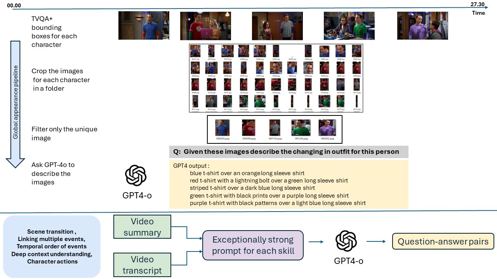

# VLV-Bench: A Comprehensive benchmark for very long-form videos understanding
# Overview

Understanding long videos, ranging from tens of minutes to several hours, presents unique challenges in video comprehension. Despite the increasing importance of long-form video content, existing benchmarks primarily focus on shorter clips. To address this gap, we introduce a comprehensive benchmark for Very Long Videos understanding (VLV-Bench), which presents
1) The longest video duration, averaging 76.34 minutes.
2) The largest number of question-answer pairs, 108.2K.
3) Diversity in questions that examine nine different skills and include both multiple-choice questions and open-ended questions.
4) Human-centric, as the video sources come from movies and daily TV shows, with specific human-level question designs such as Movie Spoiler Questions that require critical thinking and comprehensive understanding.<br>

Using VLV-Bench, we comprehensively evaluate existing Large Multi-Modality Models (LMMs) on each skill, including the commercial model Gemini 1.5 Flash and the open-source models. Evaluation shows significant challenges in our benchmark. We hope this benchmark will stimulate the LMMs community towards long video and human-level understanding.
# Paper results for ranking the top commercial and open souce models:
Tables 

# How to download videos 
1- TVQA videos <br>
Download the original TVQA videos for short videos from [here](https://tvqa.cs.unc.edu/download_tvqa.html)<br>
Run the following commmand to convert the videos to long-form videos.<br>
```python
python videos_preprocessing/convert_tvqa_from_short_to_long.py --train_path "path to the training annotation" --val_path "path to the validation annotation" --root_dir "path to the short clips directory" --full_videos_dir "path to save the full video episodes"
```
this script will output the full video episodes in the full_videos_dir and json annotations for only the validation data called "tvqa_val_edited.json" that will be used as a local questions later. <br>

To get the video .mp4 files 
Run the following script or  [Download](https://huggingface.co/datasets/Vision-CAIR/VLV-Benchmark/tree/main/tvqa_mp4_videos_tar_files)
```python
python videos_preprocessing/convert_to_mp4_format.py --video_frames_dir "path to the long videos frames" --output_dir "path to save the MP4 videos" --source "tvqa" --fps 3 
```
You can download the TVQA subtitles from here[Download](https://huggingface.co/datasets/Vision-CAIR/VLV-Benchmark/blob/main/tvqa_subtitles.zip) <br>
2- MovieNet Data <br>
Dowlnoad the original MovieNet data from [here](https://opendatalab.com/OpenDataLab/MovieNet/tree/main/raw) <br>
Filter out the movies that doesn't have shot subtitles<br>
Run the following script to filter movienet<br>
```python
python filter_movienet.py
```
To get the video .mp4 files 
Run the following script to the raw data or download our version from huggingface [Download_full_length](https://huggingface.co/datasets/Vision-CAIR/VLV-Benchmark/tree/main/Movienet_mp4_videos_full_length) or [Download_1fps](https://huggingface.co/datasets/Vision-CAIR/VLV-Benchmark/tree/main/Movienet_mp4_videos_1fps)
```python
# to generare movies with the original frame rate use original_fps = True
python videos_preprocessing/convert_to_mp4_format.py --video_frames_dir "path to the long videos frames" --output_dir "path to save the MP4 videos" --source "movienet" --original_fps --movies_has_subtitles "movies_has_subtitles.json" --movies_durations "movies_durations.json" 
# to generate movies with 1 fps use original_fps = False and fps = 1 but take care that the video duration will be different from the original duration 
python videos_preprocessing/convert_to_mp4_format.py --video_frames_dir "path to the long videos frames" --output_dir "path to save the MP4 videos" --source "movienet" --fps 1 --movies_has_subtitles "movies_has_subtitles.json" --movies_durations "movies_durations.json" 
```
# Annotation files 
You can find the annotation files for the 9 skills in huggingface datasets format [here](https://huggingface.co/datasets/Vision-CAIR/VLV-Benchmark/tree/main/Benchmark_annotations)
# How to re-create the Benchmark  

## Prepare the data sources
### Data scrapping 
1) We scrapped the all the TVQA summaries from IMDB. 
2) We scrapped the all the MovieNet summaries from IMDB. 
3) We scrapped the transcripts for all the TVQA videos. 
5) We filtered out scripts for the movies that doesn't have shot subtitles from the MovieNet data.
6) We filtered out scripts for the edpisodes that doesn't exist in Long TVQA.
7) We scrapped the the spoiler questions for all the movies in movieNet.
8) We scrapped the movies durations from IMDB.

You can see the code for scrapping the data from IMDB [here](https://github.com/Vision-CAIR/Long_video_Bench/tree/main/scrapping) but don't need to re-run it as we provide the filtered data in the benchmark sources.
### Bechmark sources : 
1) TVQA and MovieNet filtered summaries and scripts. [Download](https://huggingface.co/datasets/Vision-CAIR/VLV-Benchmark/tree/main/sources)
2) TVQA+ annotations [Download](https://tvqa.cs.unc.edu/download_tvqa_plus.html) 
## Annotation pipeline
### Global appearance <br>
1) Download TVQA+ annotations to this directory `global_apprerance/tvqa`.
2) Filter the characters appearance in separate folders by running the following script.
```python
cd global_apprerance/tvqa
bash Run_full_pipeline.sh
```
1) Choose the best and unique outfits for each character.(humanly).
2) Run the following script to get the descriptions for the unique outfits.
```python 
python gpt4_description.py --data_path "path to the unique images folder" --output_path "path to the output folder" --api_key "GPT-4o API key"
```
1) Run the following script for question generation.
```python
python questions_generation/tvqa/global_apperance_qa_generation.py --gpt4_descriptions "path to the json file with the descriptions" --existed_episodes "existed_videos_tvqa.json"
```
### Scene transition 
```python 
python GPT-4/tvqa/python scene_transitions.py --api_key "GPT-4 API key" --scripts_folder "path to the episodes scripts folder" --output_dir "path to the output directory" --output_json "path to the output json file" --num_tasks 64
# for question generation run the following script
python questions_generation/tvqa/scene_transition_qa_generation.py --gpt4_output "path to the output json file" --existed_episodes "existed_videos_tvqa.json"
```
### Squence of character actions 
For TVQA 
```python 
python GPT-4/tvqa/character_actions.py --api_key "GPT-4 API key" --scripts_folder "path to the episodes scripts folder" --summaries_folder "path to the summaries folder" --output_dir "path to the output directory" --output_json "path to the output json file" --num_tasks 64

# for question generation run the following script
python questions_generation/tvqa/character_actions_mcq.py --gpt4_output "path to the output json file" 
```
For MovieNet 
```python 
python GPT-4/movienet/character_actions.py --api_key "GPT-4 API key" --scripts_folder "path to the movies scripts folder" --summaries_folder "path to the movies summaries folder" --output_dir "path to the output directory" --output_json "path to the output json file" --num_tasks 64
# for question generation run the following script
python questions_generation/movienet/character_actions_mcq_movienet.py --gpt4_output "path to the output json file" 
```
### Deep context understanding 
For TVQA 
```python 
python GPT-4/tvqa/context_understanding.py --api_key "GPT-4 API key" --scripts_folder "path to the episodes scripts folder" --summaries_folder "path to the summaries folder" --output_dir "path to the output directory" --output_json "path to the output json file" --num_tasks 64

# for question generation run the following script
python questions_generation/tvqa/context_understanding.py --gpt4_output "path to the output json file" 
```
For MovieNet 
```python 
python GPT-4/movienet/context_understanding.py --api_key "GPT-4 API key" --scripts_folder "path to the movies scripts folder" --summaries_folder "path to the movies summaries folder" --output_dir "path to the output directory" --output_json "path to the output json file" --num_tasks 64
# for question generation run the following script
python questions_generation/movienet/context_understanding.py --gpt4_output "path to the output json file" 
```
### Linking multiple events 
For TVQA 
```python 
python GPT-4/tvqa/linking_events.py --api_key "GPT-4 API key"  --summaries_folder "path to the summaries folder" --output_dir "path to the output directory" --output_json "path to the output json file" --num_tasks 64

# for question generation run the following script
python questions_generation/tvqa/linking_events.py --gpt4_output "path to the output json file" 
```
For MovieNet 
```python 
python GPT-4/movienet/linking_events.py --api_key "GPT-4 API key"  --summaries_folder "path to the movies summaries folder" --output_dir "path to the output directory" --output_json "path to the output json file" --num_tasks 64
# for question generation run the following script
python questions_generation/movienet/linking_events.py --gpt4_output "path to the output json file" 
```
### Temporal events 
For TVQA 
```python 
python GPT-4/tvqa/temporal_events.py --api_key "GPT-4 API key" --scripts_folder "path to the episodes scripts folder" --output_dir "path to the output directory" --output_json "path to the output json file" --num_tasks 64

# for question generation run the following script
python questions_generation/tvqa/temporal_events_qa_generation.py --gpt4_output "path to the output json file" 
```
For MovieNet 
```python 
python GPT-4/movienet/temporal_events.py --api_key "GPT-4 API key" --scripts_folder "path to the movies scripts folder" --output_dir "path to the output directory" --output_json "path to the output json file" --num_tasks 64
# for question generation run the following script
python questions_generation/movienet/temporal_events_qa_generation.py --gpt4_output "path to the output json file" 
```
### Movies spoiler questions 
```python 
python questions_generation/spoiler_questions.py --scrapped_spoiler_questions "path to the scrapped spoiler questions"
```
### Summarization 
```python
python questions_generation/summarization_skill.py --summarization_movienet_json "path to json file of movienet summaries" --summarization_tvqa_json "path to json file of tvqa summaries" --api_key "GPT-4 API key"
```

### Local visual and context understanding 
We converted the questions of the validation split from the original TVQA to Long form questions here 
`process_tvqa_videos/tvqa_val_edited.json`
```python 
python questions_generation/long_tvqa_questions.py --tvqa_val_edited "process_tvqa_videos/tvqa_val_edited.json"
```

# Evaluation
To use our evaluation scrip for accuracy and GPT4 score you should prepare your predictions in the following format 
```python 
[
    {"Q":"question",  "A","answer", "pred":"model_pred"}  ,
    {"Q":"question",  "A","answer", "pred":"model_pred"}  ,
    {"Q":"question",  "A","answer", "pred":"model_pred"}  ,
    ... 
]
```
Then run the following script for accuracy evaluation for the skills that has multiple choice questions 
```bash
# set the parameters in the script
bash evaluation/GPT4_eval/gpt4_accuracy.sh 
```
For the skills that has open-ended questions run the following script to get the GPT4 score
```bash
# set the parameters in the script
bash evaluation/GPT4_eval/gpt4_score.sh 
```


# Citation
If you're using VLV-Bench in your research or applications, please cite using this BibTeX:
```

```

# Acknowledgements
[Video-ChatGPT](https://mbzuai-oryx.github.io/Video-ChatGPT)

# License
This repository is under [BSD 3-Clause License](LICENSE.md).
