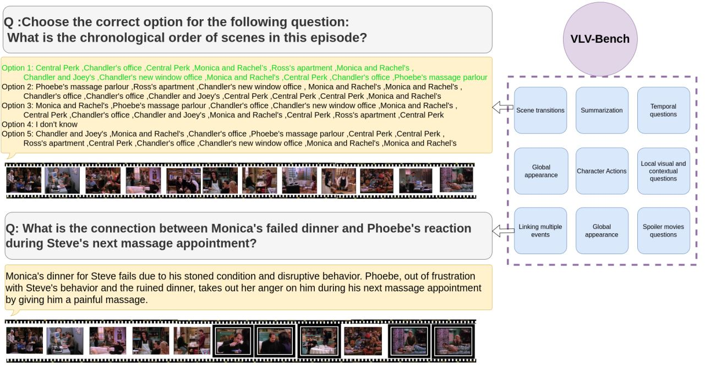
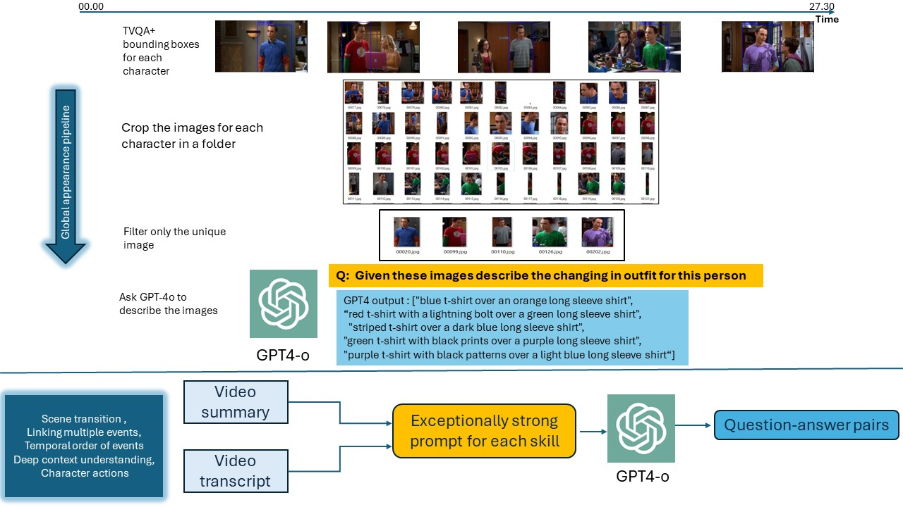

# VLV-Bench: A Comprehensive benchmark for very long-form videos understanding

# How to download videos 
1- TVQA videos <br>
2- MovieNet Data 

# Annotation files 
You can find the annotation files for the 9 skills here 

# How to create the Benchmark  
## Data scrapping 
1- We scrapped the all the TVQA summaries from IMDB. <br>
2- We scrapped the all the MovieNet summaries from IMDB. <br>
3- We scrapped the transcripts for all the TVQA videos. <br> 
## Bechmark sources : 
1- TVQA summaries and scripts. [Download from here]() <br>
2- MovieNet summaries and scripts.[Download from here]()  or the original source from [here]()<br>
3- TVQA+ annotations [Download from here]()  or the original source from [here]()<br>
## Annotation pipeline
### Global appearance <br>
1- Download TVQA+ annotations <br>
2- Filter the characters appearance in separate folders [here]().<br>
3- Choose the best and unique outfits for each character.(humanly). 

### Scene transition 
set the API key for GPT-4 and run the following script [here]()
### Squence of character actions 
For movieNet set the API key for GPT-4 and run the following script [here]()<br>
For TVQA set the API key for GPT-4 and run the following script [here]()<br>
Run this to gather the data together for both movieNet and TVQA[here]()
### Deep context understanding 
For movieNet set the API key for GPT-4 and run the following script [here]()<br>
For TVQA set the API key for GPT-4 and run the following script [here]()<br>
Run this to gather the data together for both movieNet and TVQA[here]()
### Linking multiple events 
For movieNet set the API key for GPT-4 and run the following script [here]()<br>
For TVQA set the API key for GPT-4 and run the following script [here]()<br>
Run this to gather the data together for both movieNet and TVQA[here]()
### Temporal events 
For movieNet set the API key for GPT-4 and run the following script [here]()<br>
For TVQA set the API key for GPT-4 and run the following script [here]()<br>
Run this to gather the data together for both movieNet and TVQA[here]()
### Movies spoiler questions 
To extract the spoiler questions for movieNet run the following script to scrap the questions from IMDB.[here]()<br>
### Summarization 
For TVQA run the following script to scrap the data from IMDB  [here]()<br>
For MovieNet run the following script to scrap the data from IMDB  [here]()

### Local visual and context understanding 
We converted the questions of the validation split from the original TVQA to Long form questions. [here]()<br>


If you're using VLV-Bench in your research or applications, please cite using this BibTeX:
```
<!-- @article{ataallah2024minigpt4,
  title={MiniGPT4-Video: Advancing Multimodal LLMs for Video Understanding with Interleaved Visual-Textual Tokens},
  author={Ataallah, Kirolos and Shen, Xiaoqian and Abdelrahman, Eslam and Sleiman, Essam and Zhu, Deyao and Ding, Jian and Elhoseiny, Mohamed},
  journal={arXiv preprint arXiv:2404.03413},
  year={2024}
} -->
```

## Acknowledgements
[Video-ChatGPT](https://mbzuai-oryx.github.io/Video-ChatGPT)

## License
This repository is under [BSD 3-Clause License](LICENSE.md).
